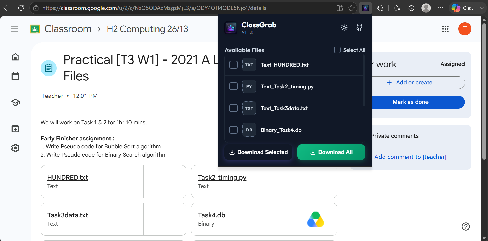

# ClassGrab

<p align="center">
  
</p>

<p align="center">
  Bulk download Google Classroom attachments from one popup.
</p>

<p align="center">
  
  
  
</p>

ClassGrab is a small Chromium extension for students and teachers who want to save the files attached to a Google Classroom post without opening each attachment one by one.

It is intended for **Google Chrome** and **Microsoft Edge** only. Requests for Firefox, Safari, or other browser builds should be opened as GitHub issues so they can be discussed and tracked separately.



## Features

- Download all supported attachments from the current Classroom post.
- Select only the files you want before starting downloads.
- Supports Google Drive file links and exports Google Docs, Sheets, and Slides to Office formats.
- Handles Google Drive "can't scan this file" confirmation pages when Drive exposes a confirmation URL.
- Shows visible per-file status and remembers recent outcomes after the popup closes.
- Deduplicates repeated Classroom anchors for the same attachment.
- Dark and light popup themes.
- Localized extension metadata and popup text for English, Spanish, French, Simplified Chinese, and Vietnamese.

## Store Availability

ClassGrab v1.1.2 is available for:

- Chrome Web Store
- Microsoft Edge Add-ons

Packaged locales are English, Spanish, French, Simplified Chinese, and Vietnamese. ClassGrab v1.0.0 was the first store release. Other browser stores are not part of the current release scope. Open a feature request if you want another browser supported.

## Installation

### Developer Mode

1. Clone or download this repository.
2. Open `chrome://extensions/` in Chrome or `edge://extensions/` in Microsoft Edge.
3. Turn on Developer mode.
4. Click Load unpacked.
5. Select the root `classgrab` folder.
6. Refresh any open Google Classroom tabs before using the extension.

## Usage

1. Open a Google Classroom post, assignment, or announcement with file attachments.
2. Click the ClassGrab extension icon.
3. Select individual files, or use Select All.
4. Click Download Selected or Download All.
5. If Google Drive still requires manual confirmation, ClassGrab opens the Drive file page so you can finish the download.

## Supported Attachments

| Source | Download behavior |
| --- | --- |
| Google Drive file links | Direct Drive download |
| Google Docs | Export as `.docx` |
| Google Sheets | Export as `.xlsx` |
| Google Slides | Export as `.pptx` |
| Unsupported links | Ignored for now |

## Versions

### v1.1.2

- Added localized extension metadata and popup text for English, Spanish, French, Simplified Chinese, and Vietnamese.
- Added release/security checks for locale package drift and required message coverage.
- Updated the publishing guide with Chrome and Edge localization steps.

### v1.1.1

- Added a reproducible release command for local and GitHub release packaging.
- Added automated security and privacy checks for permissions, secrets, unsafe HTML APIs, package contents, and PNG metadata.
- Hardened popup rendering and download status tracking to reduce silent failures and stored URL metadata.
- Replaced the README preview with a more aggressively redacted v1.1.x screenshot.

### v1.1.0

- Updated the README with current Chrome Web Store and Microsoft Edge Add-ons availability.
- Replaced the generated README preview with a real, censored Classroom screenshot.
- Added visible error and status messages for message and download failures.
- Added persistent download outcome tracking for reopened popups.
- Added Drive confirmation handling for files that show "Download anyway".
- Added Google Docs, Sheets, and Slides export support.
- Added attachment deduplication and filename fallback warnings.
- Fixed unsafe active-tab URL handling.
- Fixed missing accent button background.
- Removed Firefox-specific manifest metadata.

### v1.0.0

- Initial ClassGrab release with bulk download, selected download, cleaned filenames, and theme toggle.

## FAQ

### Why did a file download as `.htm` or `.html`?

Google Drive sometimes returns a warning page instead of the actual file. This can happen when Drive cannot scan a file, such as a script or archive, or when the owner blocks downloads.

ClassGrab now tries to resolve the "Download anyway" confirmation automatically. If Drive does not expose a confirmation URL, ClassGrab opens the original Drive page so you can finish the download manually.

### Why are some files missing?

ClassGrab focuses on Google Drive files and Google Docs, Sheets, and Slides. Third-party links, YouTube videos, Forms, folders, and external websites are not downloaded yet.

### Why do I need to refresh Google Classroom after installing or reloading the extension?

Chrome injects the content script when the Classroom page loads. If the page was already open before the extension was installed or reloaded, refresh the tab so ClassGrab can read the attachments.

### Does ClassGrab read my Classroom data?

ClassGrab only scans links on the active Google Classroom page when you open the popup. It does not use a backend, analytics, or tracking.

### Does ClassGrab support Firefox or Safari?

No. ClassGrab targets Chrome and Edge. For other browsers, open a GitHub issue with the browser name, use case, and whether you are willing to test builds.

### Can ClassGrab bypass owner download restrictions?

No. If the file owner or school administrator disables download permissions, ClassGrab cannot override that. Ask the owner to enable downloads for viewers.

## Contributing

Bug reports and feature requests are welcome. For large changes, open an issue first so the behavior, browser scope, and testing plan are clear before implementation.

### Release Package Check

Before preparing a store update, run:

```powershell
powershell -NoProfile -ExecutionPolicy Bypass -File .\tools\release.ps1
```

The command verifies the version in `manifest.json`, the popup badge, and README release markers, runs JavaScript syntax checks plus `git diff --check`, rebuilds `ClassGrab.zip`, and rejects package contents that do not match the tracked store upload files, including `_locales/`.

It also runs `tools/security-check.ps1`, which gates reviewed permissions, required locale files/messages, common secret and personal-data patterns, PNG text metadata, remote script/style loads, unsafe HTML injection APIs, and private files in the release package.

## Acknowledgements

README structure and store-badge style were inspired by the public [ClassFetch](https://github.com/DeeptejD/ClassFetch) extension README.

## Disclaimer

ClassGrab is not affiliated with Google, Google Classroom, Google Drive, Chrome, or Microsoft Edge.
