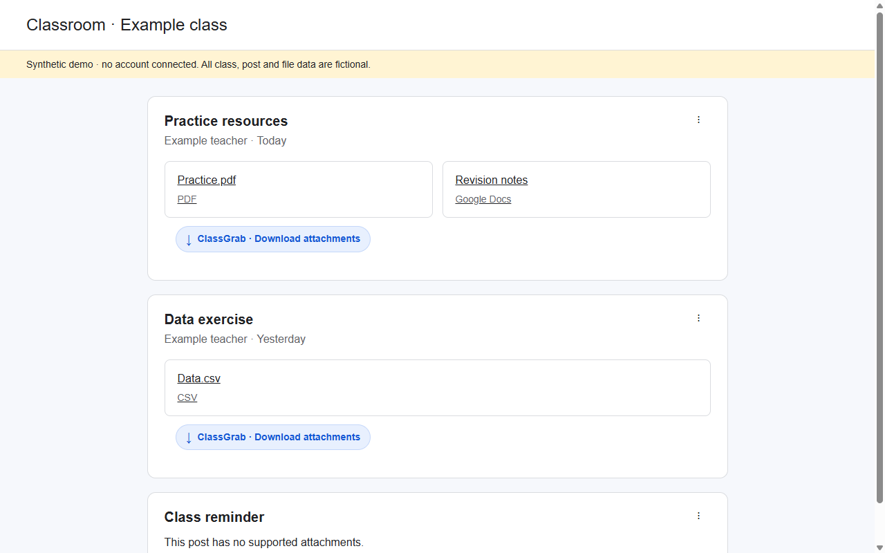

# ClassGrab

<p align="center">
  
</p>

<p align="center">
  Download one Google Classroom post's attachments from its Stream card or popup.
</p>

<p align="center">
  
  
  
</p>

ClassGrab is a small Chromium extension for students and teachers who want to save the files attached to a Google Classroom post without opening each attachment one by one.

It is intended for **Google Chrome** and **Microsoft Edge** only. Version 1.2.1 requires Chromium 127 or newer to open the popup from a Stream button. Requests for Firefox, Safari, or other browser builds should be opened as GitHub issues so they can be discussed and tracked separately.



This capture shows the actual 1.2.0 controls on a synthetic example with no
account connected. Signed-in Classroom and real downloads still require the
manual checks in the store guide.

## Features

- Download all supported attachments from the current Classroom post.
- Use **ClassGrab · Download attachments** on a Stream post to start that post's files immediately, without opening its details.
- Select only the files you want before starting downloads.
- Prepares multiple attachments concurrently for faster bulk download startup.
- Supports Google Drive file links and exports Google Docs, Sheets, and Slides to Office formats.
- Handles Google Drive "can't scan this file" confirmation pages when Drive exposes a confirmation URL.
- Shows visible per-file status and remembers recent outcomes after the popup closes.
- Preserves every status record when several downloads start together.
- Deduplicates repeated Classroom anchors for the same attachment.
- Downloads only the open post or the Stream card you clicked, excluding other and previously visited posts.
- Warns about recent ClassGrab downloads before repeating them, with Skip duplicates, Download again, and Cancel choices.
- Closes the popup after a successful batch starts so the browser download list is unobstructed.
- Dark and light popup themes.
- Localized extension metadata and popup text for English, Spanish, French, Simplified Chinese, and Vietnamese.

## Store Availability

ClassGrab is distributed through:

- Chrome Web Store
- Microsoft Edge Add-ons

Current package: v1.2.1. Complete the live browser checks in the [store submission guide](docs/store-submission.md) before uploading. GitHub updates do not automatically update either store.

The [1.2.1 release handoff](docs/release-1.2.1.md) records validation and the
remaining manual gates. The [1.2.0 Stream release](docs/release-1.2.0.md) and
[1.1.7 audit](docs/release-audit-1.1.7.md) are historical.
Store publication of v1.2.1 is not verified here.

Packaged locales are English, Spanish, French, Simplified Chinese, and Vietnamese. ClassGrab v1.0.0 was the first store release. Other browser stores are not part of the current release scope. Open a feature request if you want another browser supported.

## Installation

### Developer Mode

1. Clone or download this repository.
2. Open `chrome://extensions/` in Chrome or `edge://extensions/` in Microsoft Edge.
3. Turn on Developer mode.
4. Click Load unpacked.
5. Select the root `classgrab` folder.
6. Refresh any open Google Classroom tabs before using the extension.

When updating an unpacked copy, click its **Reload** button on the extensions
page, then refresh Classroom too. Confirm the version in the ClassGrab popup;
turn off other ClassGrab copies while testing so the old scanner is not used.

## Usage

On the class **Stream**, click **ClassGrab · Download attachments** beneath
one post's attachments. ClassGrab opens and starts only that card's supported
files, after any duplicate decision. No announcement detail page is required.
The button appears on identifiable cards with supported attachments; unknown
or ambiguous cards have no button. Use the details workflow below for those.

To select individual files, open the post's details and use the extension icon:

1. Open a Google Classroom post, assignment, or announcement with file attachments.
2. Click the ClassGrab extension icon.
3. Select individual files, or use Select All.
4. Click Download Selected or Download All.
5. If a duplicate warning appears, skip those files, cancel, or explicitly download completed files again. A file still downloading will always be skipped.
6. Keep the popup open during preparation. It closes when the batch has started successfully; reopen it to see saved statuses. Errors and manual-confirmation notices keep it open.
7. If Google Drive still requires manual confirmation, ClassGrab opens its file page in a background tab so the remaining files can start. Switch to that tab to finish the download.

The toolbar icon on the Stream shows instructions instead of choosing a post
automatically. For an announcement without a button, use its three-dot menu >
**Copy link**, open that link in the address bar, then open ClassGrab.
Switching tabs or posts during preparation stops files that have not started.

## Supported Attachments

| Source | Download behavior |
| --- | --- |
| Google Drive file links | Direct Drive download |
| Google Docs | Export as `.docx` |
| Google Sheets | Export as `.xlsx` |
| Google Slides | Export as `.pptx` |
| Unsupported links | Ignored for now |

## Versions

### v1.2.1

- Fixed material detail pages showing no attachments when file cards sit beside empty post controls inside Classroom's `.EE538` container.
- Require a visible marker matching the current post and reject foreign or ambiguous containers, while retaining the stale-file navigation checks.
- Added the reported nine-file layout, boundary and navigation regressions, plus an installed-extension Chromium check on a synthetic material page.

### v1.2.0

- Added a localized ClassGrab download button to each identifiable Stream card with supported attachments, including announcements.
- A button opens the popup and starts only its own post's files through the existing duplicate warning and download flow.
- Pin the clicked card, post, tab, window, and document with a short-lived launch token; reject stale, replayed, hidden, or ambiguous selections.
- Recheck the original post after Drive preparation, before automatic downloads or manual-confirmation tabs.
- Keep successful popup closure, bounded concurrent preparation, and the audited v1.1.7 history/duplicate protections.
- Require Chromium 127 or newer for the Stream popup API; no additional permissions.

### v1.1.7

- Added attachment detection for announcement detail pages, including the layout without a main area or heading.
- Require a matching current-post marker inside the announcement container and preserve stale-file checks during navigation.
- Explain how to open a single announcement from the Stream in all five popup languages.
- Added announcement discovery, containment, empty-post, and navigation regressions.
- Local release audit fixes strip legacy active-download filenames/URLs and skip in-progress duplicates before Drive preparation, including when choosing Download again.

### v1.1.6

- Fixed empty attachment lists when Classroom puts the current post ID on controls beside the file cards. The scanner now prefers the complete, verified detail view over those partial containers.
- Preserved current-post boundaries and stale-content checks, including when Classroom reuses a keyed container during navigation.
- Added regressions for the reported five-link layout, partial attachment containers, and navigation with reused post markers.

### v1.1.5

- Fixed the v1.1.4 regression that showed no files on assignment details whose attachment cards omit optional metadata attributes.
- Detects supported file links within the verified current-post view and tracks those links across navigation, preserving hidden/previous-post exclusions and duplicate warnings.
- Added a regression matching the reported seven-link layout plus navigation and visibility checks for unmarked attachments.

### v1.1.4

- Scoped attachment collection to the current post and replaced the file list on every scan, excluding stream and retained navigation content.
- Added duplicate-download warnings using recent local ClassGrab history and an atomic background guard against concurrent starts.
- Restored saved statuses when opening the popup and reconciled downloads that finish while it is closed.
- Closed successful popups after downloads are handed to the browser, keeping failures and manual confirmations visible.
- Added post-scope and duplicate-flow regression checks plus current Chrome/Edge submission instructions.

### v1.1.3

- Restored fast bulk startup with bounded concurrent Drive preparation.
- Added a regression test that prevents bulk downloads from becoming sequential again.
- Serialized local status updates so concurrent downloads cannot overwrite each other's tracking records.
- Added pre-push and CI gates for non-private Git commit identities and credential-bearing remote URLs.

### v1.1.2

- Added localized extension metadata and popup text for English, Spanish, French, Simplified Chinese, and Vietnamese.
- Added release/security checks for locale package drift and required message coverage.
- Updated the publishing guide with Chrome and Edge localization steps.

### v1.1.1

- Added a reproducible release command for local and GitHub release packaging.
- Added automated security and privacy checks for permissions, secrets, unsafe HTML APIs, package contents, and PNG metadata.
- Hardened popup rendering and download status tracking to reduce silent failures and stored URL metadata.
- Replaced the README preview with a more aggressively redacted v1.1.x screenshot.

### v1.1.0

- Updated the README with current Chrome Web Store and Microsoft Edge Add-ons availability.
- Replaced the generated README preview with a real, censored Classroom screenshot.
- Added visible error and status messages for message and download failures.
- Added persistent download outcome tracking for reopened popups.
- Added Drive confirmation handling for files that show "Download anyway".
- Added Google Docs, Sheets, and Slides export support.
- Added attachment deduplication and filename fallback warnings.
- Fixed unsafe active-tab URL handling.
- Fixed missing accent button background.
- Removed Firefox-specific manifest metadata.

### v1.0.0

- Initial ClassGrab release with bulk download, selected download, cleaned filenames, and theme toggle.

## FAQ

### Why did a file download as `.htm` or `.html`?

Google Drive sometimes returns a warning page instead of the actual file. This can happen when Drive cannot scan a file, such as a script or archive, or when the owner blocks downloads.

ClassGrab now tries to resolve the "Download anyway" confirmation automatically. If Drive does not expose a confirmation URL, ClassGrab opens the original Drive page so you can finish the download manually.

### Why are some files missing?

ClassGrab focuses on Google Drive files and Google Docs, Sheets, and Slides. Third-party links, YouTube videos, Forms, folders, and external websites are not downloaded yet.

On the Stream, use the button on one post. If it has no ClassGrab button, open
that post's full details. ClassGrab never collects the whole Stream or
Classwork overview. Unknown or ambiguous card boundaries require the details
workflow so files from neighboring posts cannot be included.

### What does the duplicate warning check?

It checks the attachment ID against ClassGrab's local status records in the same browser profile. Completed status history is limited to the last seven days and 100 recent entries; pruning happens on the next status/download operation, not on a deletion timer. Active downloads retain a browser download ID mapping until reconciliation so they cannot be started twice. Files with the same name but different IDs are separate files. A completed file needs explicit confirmation to download again; a tracked file still downloading is skipped. Failed downloads and HTML confirmation pages can be retried.

This is not a filesystem scan and does not cover downloads made outside ClassGrab, another profile, cleared history, or older records. Editing a Google file does not change its ID, so choose Download again when you want a newer revision. No filename or source URL is saved in the history.

### Why do I need to refresh Google Classroom after installing or reloading the extension?

Chrome injects the content script when the Classroom page loads. If the page was already open before the extension was installed or reloaded, refresh the tab so ClassGrab can read the attachments.

### Does ClassGrab read my Classroom data?

ClassGrab inspects visible Stream cards and their supported attachment links
locally to place per-post buttons. It also inspects the current detail view as
Classroom renders, including while the popup is closed, to recognize stale
content during navigation. Only the clicked card or open post's files are
returned to the popup for download. It checks that selection again before
starting files. Link text, URLs, and selection tokens stay in the tab's memory;
attachment IDs, browser download IDs, outcome metadata, and the theme
preference stay in local extension storage. Old active-download records
containing filenames or URLs are stripped on the next reconciliation. The
browser separately maintains its own download history. ClassGrab does not use
a backend, analytics, or tracking.

### Does ClassGrab support Firefox or Safari?

No. ClassGrab targets Chrome and Edge. For other browsers, open a GitHub issue with the browser name, use case, and whether you are willing to test builds.

### Can ClassGrab bypass owner download restrictions?

No. If the file owner or school administrator disables download permissions, ClassGrab cannot override that. Ask the owner to enable downloads for viewers.

## Contributing

Bug reports and feature requests are welcome. For large changes, open an issue first so the behavior, browser scope, and testing plan are clear before implementation.

After cloning, install the tracked pre-push privacy gate once:

```powershell
powershell -NoProfile -ExecutionPolicy Bypass -File .\tools\install-git-hooks.ps1
```

The hook runs release validation before every push. GitHub Actions runs the same security validation for every push and pull request, including documentation-only changes.

### Release Package Check

Before preparing a store update, run:

```powershell
powershell -NoProfile -ExecutionPolicy Bypass -File .\tools\release.ps1
```

The command verifies the version in `manifest.json`, the popup badge, README package markers, and store guide, runs JavaScript syntax checks, post-scope, popup-flow, bulk-download, background-storage, duplicate-download, release-package, and Git privacy regression tests, and `git diff --check`, rebuilds `ClassGrab.zip`, and rejects duplicate entries or package contents that do not match the tracked store upload files, including `_locales/`. It reads the archived manifest version and compares every ZIP payload's SHA-256 to the validated checkout. Store approval is separate from the package version.

It also runs `tools/security-check.ps1`, which gates reviewed permissions, required locale files/messages, common secret and personal-data patterns, Git commit identity and remote URL privacy, PNG text metadata, remote script/style loads, unsafe HTML injection APIs, and private files in the release package.

## Acknowledgements

README structure and store-badge style were inspired by the public [ClassFetch](https://github.com/DeeptejD/ClassFetch) extension README.

## Disclaimer

ClassGrab is not affiliated with Google, Google Classroom, Google Drive, Chrome, or Microsoft Edge.
